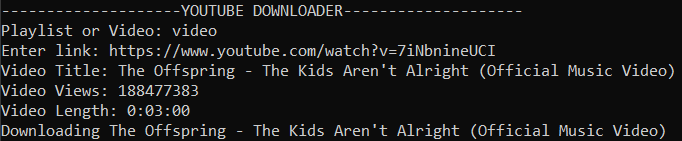
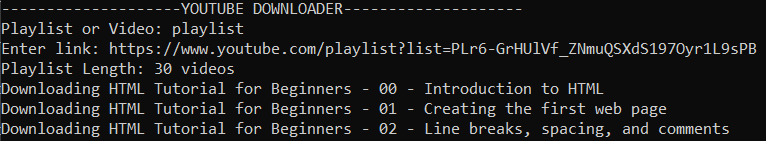

<h1 class='title' style="text-align: center;">YouTube to mp4 Converter</h1>

This application allows users to download YouTube videos and playlists using CMD.

   

How to download videos:

1. Type "video" on input request ("Playlist or Video")

2. Enter video link

    3. Video stats will be displayed and the download will start.

    *the video will be downloaded on the same file as the application

   

How to download playlists:

1. Type "playlist" on input request ("Playlist or Video")

2. Enter playlist link

    3. Playlist stats will be displayed and the download will start.

    *the videos will be downloaded on the same file as the application

